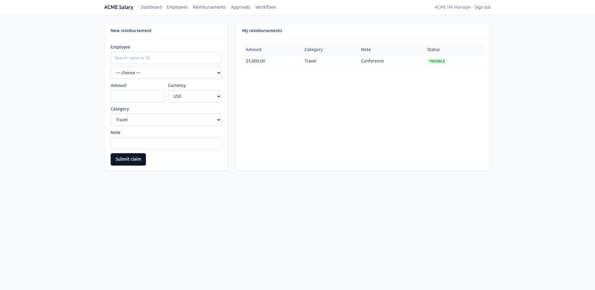
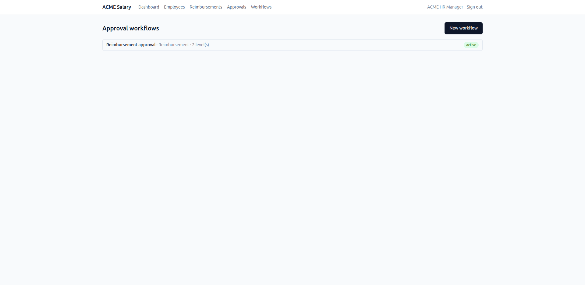

# Approvals Expansion (branch: `feature/approvals-expansion`)

This branch extends the base ACME Salary Management app with a **generic,
configurable approval workflow engine** and a **Reimbursements** feature that
consumes it.

## Why this is on a branch

The submitted `main` and its `docs/requirements.md` deliberately scope
approvals, payroll, and reimbursements **out**, with reasoning — that scoping
is an intentional product decision. To keep the submission coherent, this
exploration lives on a branch rather than rewriting `main`'s requirements.
It's the first of a planned sequence: **approvals → reimbursements →
attendance → monthly pay-run/payslips**.

## What it adds

- **Roles**: `Role` expanded to `EMPLOYEE / MANAGER / FINANCE / HR_MANAGER /
  ADMIN`; an optional `User.employeeId` links a login to an employee row.
- **Approval engine**: workflows are an ordered list of **levels**; each level
  is approved by a **role or a specific user** and may carry an **optional
  condition** (`{field, op, value}`). Reject behavior is configurable per
  workflow (`TERMINATE` or `SEND_BACK` → resubmit). Levels are any-one-of.
- **Generic seam**: a consumer attaches with `registerApprovalTarget(entityType,
  { loadContext, onApproved, onRejected })`. The engine reads the target row
  **only** through the consumer's `loadContext` (so it imports no consumer
  models) and mutates the target via the hooks on final decision. Attachment
  is **opt-in** — an entity is gated only when an active workflow exists.
- **Reimbursements**: HR/Admin file a claim for an employee, or an
  employee-user files their own. The claim routes through its workflow; on
  approval it becomes `PAYABLE`, on rejection `REJECTED`. Conditions compare on
  a **USD-normalized `amountUsd`**, never a raw local amount.
- **UI**: an approvals inbox (Awaiting-me / Submitted-by-me + approve / reject /
  resubmit), a workflow config editor (ordered levels + conditions), and a
  reimbursements page.
- **One workflow per entity type** (enforced), a **searchable user dropdown**
  for USER-level approvers (accepts email or id; resolved to a user id
  server-side), and **guarded deletion** (a workflow with approval requests
  can't be deleted).
- **Generic audit log**: a Prisma client extension records every single-record
  create/update/delete across **all tables** into an `AuditLog` (model,
  record, action, before/after, `actorUserId`), attributing the change to the
  acting user via `AsyncLocalStorage`; password hashes are redacted. Viewable
  on an **ADMIN-only Audit page** (filter by table). Bulk seed inserts and
  writes inside interactive transactions are not captured (documented limit).

## Demo (with the stack running via `docker compose up --build`)

Seeded logins (all `password123`):

| Email | Role | Notes |
|---|---|---|
| `hr@acme.test` | HR_MANAGER | files claims, configures workflows |
| `admin@acme.test` | ADMIN | configures workflows |
| `manager@acme.test` | MANAGER | level-1 approver (linked to `E00002`) |
| `finance@acme.test` | FINANCE | level-2 approver |
| `employee@acme.test` | EMPLOYEE | files own claims (linked to `E00001`) |

A sample **Reimbursement** workflow is seeded active: **L1 Manager**, then
**L2 Finance only when `amountUsd > 1000`**.

Walkthrough:
1. Sign in as `hr@acme.test` → **Reimbursements** → file a claim > $1000 for an
   employee → it becomes `PENDING`.
2. Sign in as `manager@acme.test` → **Approvals → Awaiting me** → approve → it
   advances to Finance.
3. Sign in as `finance@acme.test` → approve → the reimbursement is `PAYABLE`.
4. A claim ≤ $1000 skips the Finance level (one approval → `PAYABLE`).
5. As `admin@acme.test` → **Workflows** → edit levels/conditions or add a
   workflow for another entity type.

## Tests

- **API**: pure engine unit tests (condition coercion on Decimal-strings, level
  filtering, advancement, authorization) + integration tests (multi-level,
  conditional skip, reject modes, resubmit, 403, one-active-per-entity,
  reimbursement create→approve→PAYABLE, no-link 400, no-workflow auto-PAYABLE).
- **Web**: reimbursement submit, inbox approve, workflow build.

Run: `cd api && npm test` (needs Postgres + `salary_test` migrated) and
`cd web && npm test`.
